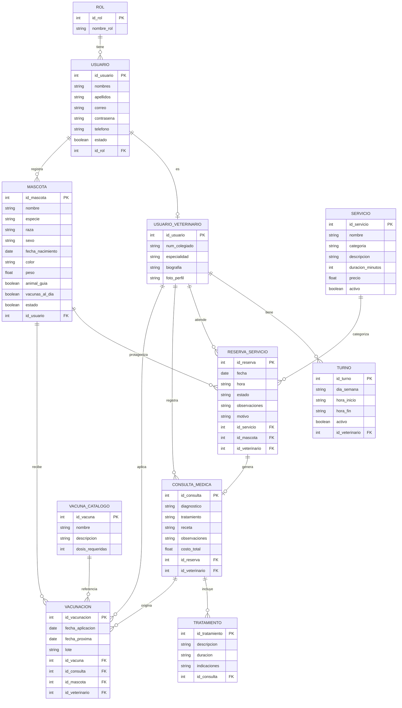

# 🐾 PetVission — Backend

API REST del sistema PetVission, desarrollada con Java 21 + Spring Boot.

---

## 👨‍💻 Equipo — Escuadrón Alpha Mango (ETM)

| Nombre | GitHub |
|---|---|
| Arantxa Fischer | [@a-scarfisch](https://github.com/a-scarfisch) |
| Cristian Diaz | [@Cristian-DH](https://github.com/Cristian-DH) |
| Cristopher Contreras | [@cristophercontrerasinformatica-dev](https://github.com/cristophercontrerasinformatica-dev) |
| Diego Peña | [@DiegoPenaG](https://github.com/DiegoPenaG) |
| Manuel Labrador | [@MannuDLab](https://github.com/MannuDLab) |
| Natalia Medel | [@NataliaMedelM](https://github.com/NataliaMedelM) |
| Sabrina Jeria | [@sabrinacecilajeria-cmyk](https://github.com/sabrinaceciliajeria-cmyk) |

---

## ⚙️ Requisitos previos

- Java 21 LTS
- Maven 3.0.6
- PostgreSQL 17
- Variables de entorno configuradas

---

## 🚀 Cómo correr el proyecto

1. Clonar el repositorio
```bash
git clone https://github.com/DiegoPenaG/Proyecto-Integrador-Pet-vission-BackEnd
```

2. Copiar el archivo de variables de entorno
```bash
cp .env.example .env
```

3. Completar los valores en `.env`
```env
DB_URL=jdbc:postgresql://localhost:5432/petvission_db
DB_USERNAME=tu_usuario
DB_PASSWORD=tu_password
JWT_SECRET=tu_clave_secreta
```

4. Ejecutar
```bash
./mvnw spring-boot:run
```

La API estará disponible en: `http://localhost:8080`

---

## 🗺️ Modelo Entidad-Relación



---

## 📁 Estructura del proyecto

```
src/main/java/com/petvission/
│
├── PetvissionApplication.java
│
├── security/
│   ├── config/
│   │   └── SecurityConfig.java
│   ├── filter/
│   │   └── JwtAuthenticationFilter.java
│   └── service/
│       ├── JwtService.java
│       └── CustomUserDetailsService.java
│
├── auth/
│   ├── controller/
│   │   └── AuthController.java
│   ├── dto/
│   │   ├── AuthRequestDto.java
│   │   ├── AuthResponseDto.java
│   │   └── RegisterRequestDto.java
│   └── service/
│       └── AuthService.java
│
├── rol/
│   ├── model/
│   │   └── Rol.java
│   ├── repository/
│   │   └── RolRepository.java
│   └── service/
│       └── RolService.java
│
├── usuario/
│   ├── controller/
│   │   └── UsuarioController.java
│   ├── dto/
│   │   ├── UsuarioRequestDto.java
│   │   └── UsuarioResponseDto.java
│   ├── mapper/
│   │   └── UsuarioMapper.java
│   ├── model/
│   │   ├── Usuario.java
│   │   └── UsuarioVeterinario.java
│   ├── repository/
│   │   ├── UsuarioRepository.java
│   │   └── UsuarioVeterinarioRepository.java
│   └── service/
│       └── UsuarioService.java
│
├── mascota/
│   ├── controller/
│   │   └── MascotaController.java
│   ├── dto/
│   │   ├── MascotaRequestDto.java
│   │   └── MascotaResponseDto.java
│   ├── mapper/
│   │   └── MascotaMapper.java
│   ├── model/
│   │   └── Mascota.java
│   ├── repository/
│   │   └── MascotaRepository.java
│   └── service/
│       └── MascotaService.java
│
├── reserva/                          ← ex cita
│   ├── controller/
│   │   └── ReservaController.java
│   ├── dto/
│   │   ├── ReservaRequestDto.java
│   │   ├── ReservaResponseDto.java
│   │   ├── ReservaUsuarioDto.java
│   │   ├── ReprogramarReservaDto.java
│   │   └── AgendaVeterinarioDto.java
│   ├── mapper/
│   │   └── ReservaMapper.java
│   ├── model/
│   │   ├── ReservaServicio.java
│   │   └── EstadoReserva.java        ← enum: PENDIENTE, CONFIRMADA, CANCELADA, COMPLETADA
│   ├── repository/
│   │   └── ReservaRepository.java
│   └── service/
│       └── ReservaService.java
│
├── servicio/                         ← nuevo módulo
│   ├── controller/
│   │   └── ServicioController.java
│   ├── dto/
│   │   └── ServicioResponseDto.java
│   ├── model/
│   │   ├── Servicio.java
│   │   └── CategoriaServicio.java    ← enum: CONSULTA_MEDICA, VACUNACION, SERVICIO
│   ├── repository/
│   │   └── ServicioRepository.java
│   └── service/
│       └── ServicioService.java
│
├── consulta/                         ← ex atencion
│   ├── controller/
│   │   └── ConsultaController.java
│   ├── dto/
│   │   ├── ConsultaRequestDto.java
│   │   └── ConsultaResponseDto.java
│   ├── mapper/
│   │   └── ConsultaMapper.java
│   ├── model/
│   │   ├── ConsultaMedica.java
│   │   └── Tratamiento.java
│   ├── repository/
│   │   ├── ConsultaRepository.java
│   │   └── TratamientoRepository.java
│   └── service/
│       └── ConsultaService.java
│
├── vacunacion/                       ← nuevo módulo
│   ├── controller/
│   │   └── VacunacionController.java
│   ├── dto/
│   │   ├── VacunacionRequestDto.java
│   │   └── VacunacionResponseDto.java
│   ├── model/
│   │   ├── Vacunacion.java
│   │   └── VacunaCatalogo.java
│   ├── repository/
│   │   ├── VacunacionRepository.java
│   │   └── VacunaCatalogoRepository.java
│   └── service/
│       └── VacunacionService.java
│
├── turno/                            ← ex horario
│   ├── controller/
│   │   └── TurnoController.java
│   ├── dto/
│   │   ├── TurnoRequestDto.java
│   │   └── TurnoResponseDto.java
│   ├── model/
│   │   └── Turno.java
│   ├── repository/
│   │   └── TurnoRepository.java
│   └── service/
│       └── TurnoService.java
│
└── shared/
    ├── exception/
    │   ├── GlobalExceptionHandler.java
    │   ├── ResourceNotFoundException.java
    │   └── UnauthorizedException.java
    ├── health/
    │   └── HealthController.java
    └── response/
        └── ApiResponse.java
```

---

## 📡 Endpoints

### Auth — Público
| Método | Ruta | Descripción |
|---|---|---|
| POST | `/api/auth/register` | Registro de usuario |
| POST | `/api/auth/login` | Inicio de sesión |

### Servicios — Público
| Método | Ruta | Descripción |
|---|---|---|
| GET | `/api/servicios` | Listar servicios activos |

### Reservas — Requiere JWT
| Método | Ruta | Descripción |
|---|---|---|
| GET | `/api/reservas` | Todas las reservas (ADMIN) |
| POST | `/api/reservas` | Agendar reserva |
| GET | `/api/reservas/usuario/{id}` | Reservas de un cliente |
| GET | `/api/reservas/veterinario/{id}` | Agenda del veterinario |
| GET | `/api/reservas/agenda` | Agenda general |
| GET | `/api/reservas/agenda/veterinario/{id}` | Agenda mensual veterinario |
| GET | `/api/reservas/fecha` | Reservas por fecha |
| GET | `/api/reservas/disponibilidad` | Disponibilidad básica |
| PATCH | `/api/reservas/{id}/cancelar` | Cancelar reserva |
| PATCH | `/api/reservas/{id}/reprogramar` | Reprogramar reserva |

### Consulta Médica — Requiere JWT
| Método | Ruta | Descripción |
|---|---|---|
| POST | `/api/consultas` | Registrar consulta |
| GET | `/api/consultas/mascota/{id}` | Historial clínico de mascota |
| PATCH | `/api/consultas/{id}/diagnostico` | Registrar diagnóstico |
| PATCH | `/api/consultas/{id}/tratamiento` | Registrar tratamiento |

### Vacunación — Requiere JWT
| Método | Ruta | Descripción |
|---|---|---|
| POST | `/api/vacunacion` | Registrar vacuna aplicada |
| GET | `/api/vacunacion/mascota/{id}` | Historial de vacunas de mascota |
| GET | `/api/vacunacion/catalogo` | Catálogo de vacunas disponibles |

### Usuarios y Mascotas — Requiere JWT
| Método | Ruta | Descripción |
|---|---|---|
| GET | `/api/usuarios` | Listar usuarios (ADMIN) |
| GET | `/api/mascotas/usuario/{id}` | Mascotas de un usuario |

### Sistema
| Método | Ruta | Descripción |
|---|---|---|
| GET | `/api/health` | Estado del servidor y BD |

---

## 🔄 Cambios Fase 2 respecto a Fase 1

| Fase 1 | Fase 2 | Tipo de cambio |
|---|---|---|
| `cita` → `Cita` | `reserva` → `ReservaServicio` | Renombrado |
| `atencion` → `HistorialClinico` | `consulta` → `ConsultaMedica` | Renombrado + ajuste |
| `horario` → (model) | `turno` → `Turno` | Renombrado |
| `/api/citas` | `/api/reservas` | Endpoint actualizado |
| `/api/historial` | `/api/consultas` | Endpoint actualizado |
| Sin `idMascota` en reserva | `idMascota` requerido en reserva | Campo agregado |
| Sin módulo `servicio` | `servicio` con seed de 3 categorías | Nuevo módulo |
| Sin módulo `vacunacion` | `vacunacion` + `vacuna_catalogo` | Nuevo módulo |

---

## 🛠️ Stack

| Tecnología | Versión |
|---|---|
| Java | 21 LTS |
| Spring Boot | Última estable |
| Spring Security | Incluida |
| PostgreSQL | 17 |
| Maven | 3.0.6 |
| JWT | io.jsonwebtoken |
| Lombok | Última estable |

---

## 🔗 Repositorios

- Frontend: [petvission-front](https://github.com/DiegoPenaG/petvission-front)
- Backend: [Proyecto-Integrador-Pet-vission-BackEnd](https://github.com/DiegoPenaG/Proyecto-Integrador-Pet-vission-BackEnd)
